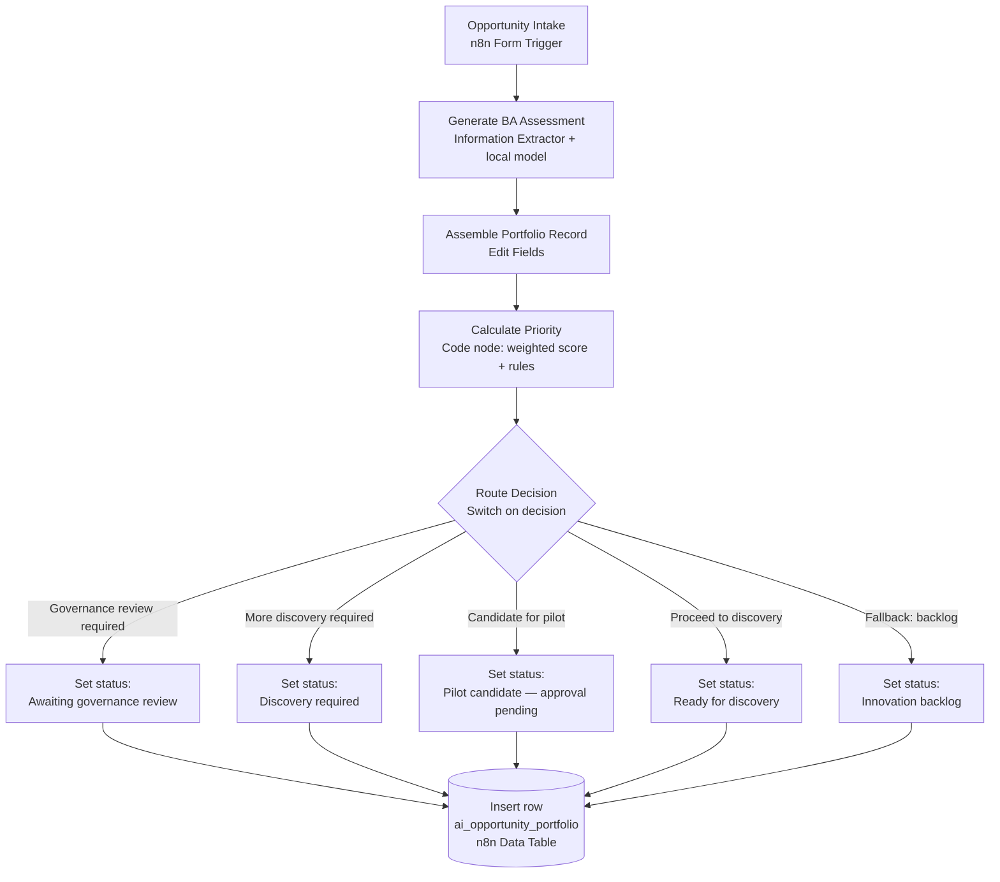
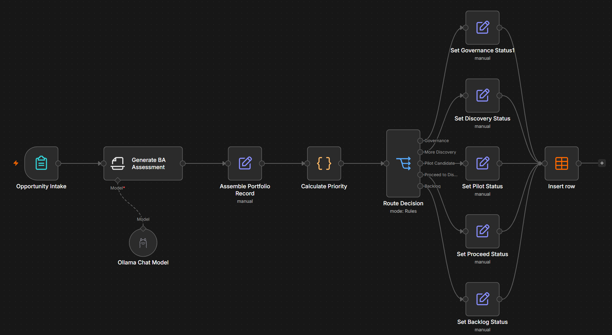
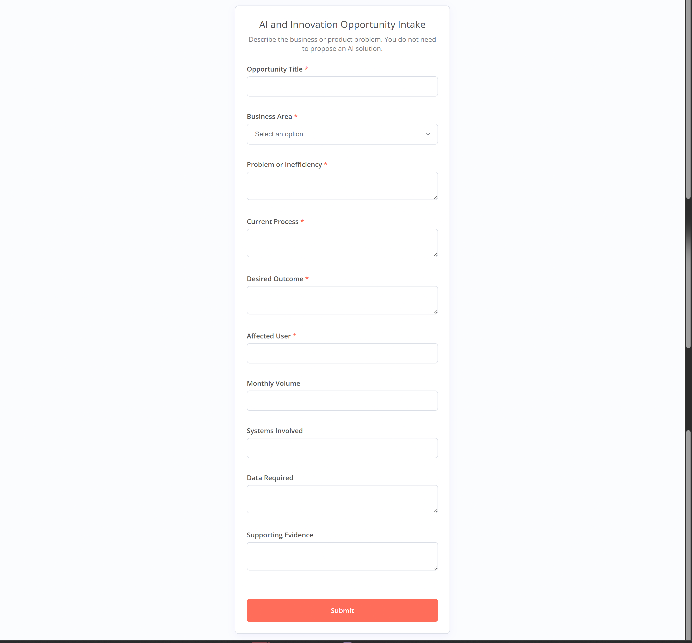

# AI Opportunity Discovery and Prioritisation Workflow for an EdTech AI and Innovation Team

A working n8n prototype that captures AI and innovation ideas through a simple form, runs a structured first-pass business analysis with a local language model, scores each idea against a weighted framework, routes it to the right next step, and stores the result in a portfolio table.

> **Proof of concept, not a production system.** This was built and run locally with the free n8n Community Edition and a local model. It uses fictional data throughout. It is a portfolio project that shows how a Business Analyst would design, govern and test this kind of automation. It is not deployed anywhere and is not connected to any real company system. See the [Disclaimer](#disclaimer).

---

## Table of contents

1. [Project overview](#1-project-overview)
2. [Business problem](#2-business-problem)
3. [Intended users](#3-intended-users)
4. [Project objectives](#4-project-objectives)
5. [Solution summary](#5-solution-summary)
6. [Workflow architecture](#6-workflow-architecture)
7. [Node-by-node explanation](#7-node-by-node-explanation)
8. [Opportunity scoring method](#8-opportunity-scoring-method)
9. [Routing decisions](#9-routing-decisions)
10. [Responsible-AI and human-oversight controls](#10-responsible-ai-and-human-oversight-controls)
11. [Technology stack](#11-technology-stack)
12. [Local setup instructions](#12-local-setup-instructions)
13. [How to import and run the workflow](#13-how-to-import-and-run-the-workflow)
14. [Test scenarios and results](#14-test-scenarios-and-results)
15. [Known limitations](#15-known-limitations)
16. [Proposed production architecture](#16-proposed-production-architecture)
17. [Skills demonstrated](#17-skills-demonstrated)
18. [Repository structure](#18-repository-structure)
19. [Screenshots](#19-screenshots)
20. [Disclaimer](#20-disclaimer)

---

## 1. Project overview

Teams generate more AI ideas than any innovation function can act on, and the ideas arrive in inconsistent shapes: a Slack message here, a slide there, a hallway conversation somewhere else. Some are worth a pilot. Many need more evidence first. A few carry real privacy or safeguarding risk and should never move without governance sign-off.

This project shows one way a Business Analyst can bring order to that intake. It takes a submitted idea, produces a preliminary assessment, applies a transparent scoring model, decides the appropriate next step, and records everything in a single portfolio table that a team can review and prioritise.

The point of the build is not the technology. It is the analysis and governance around it: how the problem is framed, how value and risk are weighed, where a human has to step in, and how the design would change if a company actually adopted it.

## 2. Business problem

An imagined EdTech company has a small AI and Innovation team. Colleagues across product, engineering, learning content, support, operations and other areas keep proposing AI ideas. The team faces three recurring difficulties:

- **Inconsistent intake.** Ideas come in different formats with different levels of detail, which makes them hard to compare.
- **No shared basis for prioritisation.** Without a common scoring model, louder or more senior voices tend to win, rather than the ideas with the strongest evidence and value.
- **Risk that surfaces late.** Ideas that touch children's data, biometrics or high-impact decisions sometimes reach a pilot before anyone has done a proper privacy or safeguarding check.

The team needs a consistent front door for ideas that captures enough detail to assess them, applies the same yardstick to every submission, and flags governance concerns at the start rather than after work has begun.

## 3. Intended users

- **AI and Innovation team (primary).** They receive submissions, review the assessment and score, and decide what actually happens next.
- **Idea submitters across the business.** Any colleague with a problem worth solving. They describe the problem, not a technical solution.
- **Governance, privacy and safeguarding reviewers.** They pick up anything the workflow flags for review before it can progress.
- **Leadership.** They see a single prioritised portfolio rather than a scattered list of pet projects.

## 4. Project objectives

- Provide one consistent intake form for AI and innovation opportunities.
- Produce a structured first-pass assessment of each idea, focused on the underlying problem rather than the proposed tool.
- Score every opportunity against the same weighted framework so comparisons are fair.
- Route each opportunity to a clear next step, with governance taking priority over score.
- Keep a human in control of every real decision.
- Store the results in a portfolio that supports review and prioritisation.

## 5. Solution summary

A colleague submits an idea through an n8n form. A local language model reads the submission and returns a structured assessment: a neutral summary, six 1-to-5 scores, a recommended next action, stated assumptions and any governance concerns. A code step combines the six scores into a single weighted priority score and applies the routing rules. A switch sends the opportunity down one of five branches, each of which sets an appropriate status. The finished record is inserted into a portfolio data table.

Every score the model produces is a **preliminary recommendation for a human to review**, not a decision. The workflow deliberately stops at "here is the suggested next step and why". A person in the AI and Innovation team decides whether anything moves forward.

## 6. Workflow architecture



The stages, in plain terms:

`Opportunity Intake` → `AI Assessment` → `Record Assembly` → `Priority Calculation` → `Decision Routing` → `Status and Ownership` → `Portfolio Storage`

## 7. Node-by-node explanation

| # | Node | Type | What it does |
|---|------|------|--------------|
| 1 | **Opportunity Intake** | Form Trigger | Presents a web form titled "AI and Innovation Opportunity Intake". Collects the opportunity title, business area, the problem, the current process, the desired outcome, affected users, monthly volume, systems involved, data required and any supporting evidence. Submitters describe a problem; they are told they do not need to propose an AI solution. |
| 2 | **Generate BA Assessment** | Information Extractor (LangChain) | Sends the submission to a local model with a detailed Business Analyst system prompt. Returns a structured JSON assessment: `summary`, `opportunity_type`, six scores (`strategic_alignment`, `expected_value`, `reach`, `evidence_strength`, `feasibility`, `risk`), a single `recommendation`, `assumptions` and `governance_concerns`. |
| 3 | **Ollama Chat Model** | Ollama Chat Model (LangChain) | The local model that powers the assessment. Configured for `llama3.2:3b` at temperature 0.1 for consistent, low-variance output. Runs on the machine, so no submission leaves the local environment. |
| 4 | **Assemble Portfolio Record** | Edit Fields (Set) | Combines the original form input with the model's assessment into one flat record ready for scoring and storage. |
| 5 | **Calculate Priority** | Code node | Validates and clamps each score to the 1–5 range, computes the weighted priority score, assigns a `priority` band (High / Medium / Low), applies the routing rules to set `decision`, and stamps `opportunity_id`, `submitted_at` and an initial `status`. |
| 6 | **Route Decision** | Switch | Reads `decision` and routes the opportunity down one of five outputs: Governance, More Discovery, Pilot Candidate, Proceed to Discovery, or a Backlog fallback. |
| 7–11 | **Set … Status** | Edit Fields (Set) ×5 | Each branch sets a branch-specific `status` (for example "Awaiting governance review" or "Pilot candidate — approval pending"). This is where per-branch ownership and reviewer assignment would also be set — see [Known limitations](#15-known-limitations). |
| 12 | **Insert row** | Data Table | Writes the finished record into the `ai_opportunity_portfolio` data table. |

## 8. Opportunity scoring method

The local model scores six dimensions on a 1–5 scale using the rubric in the system prompt. The `Calculate Priority` code node then combines them into a single weighted score:

| Component | Weight | Notes |
|-----------|:------:|-------|
| Strategic alignment | 20% | How clearly the idea supports a stated business, product or learner objective. |
| Expected value | 25% | The size and credibility of the benefit. |
| Reach | 15% | How many people or how large a group is affected. |
| Evidence strength | 10% | How well the problem and benefit are actually supported. |
| Feasibility | 15% | Whether the data, systems and delivery route look available. |
| Risk-adjusted component | 15% | Calculated as `(6 − risk) × 0.15`, so a higher risk score lowers the total. |

The exact calculation from the workflow:

```
priority_score =
    strategic_alignment × 0.20
  + expected_value      × 0.25
  + reach               × 0.15
  + evidence_strength   × 0.10
  + feasibility         × 0.15
  + (6 − risk)          × 0.15
```

With every input on a 1–5 scale, the priority score always falls between **1.0 and 5.0**. The priority band is then:

- **High** — score of 4.0 or more
- **Medium** — score of 3.0 to 3.99
- **Low** — score below 3.0

**The scores are AI-generated preliminary recommendations. They are not objective facts and they are not final business decisions.** A small local model will get things wrong, and its judgement of "value" or "strategic alignment" is only as good as the information in the submission. The score exists to help a human compare ideas and start a conversation, not to replace one. Full detail, including the anti-inflation rules and the evidence constraints, is in [docs/scoring-framework.md](docs/scoring-framework.md).

## 9. Routing decisions

The `decision` is set by rules applied in strict order. The first rule that matches wins:

1. **Risk is 4 or 5** → **Governance review required**
2. Otherwise, **evidence strength is 1 or 2** → **More discovery required**
3. Otherwise, **priority score is 4.0 or more** → **Candidate for pilot**
4. Otherwise, **priority score is 3.0 or more** → **Proceed to discovery**
5. Otherwise → **Innovation backlog**

Because risk is checked first, **a high priority score never overrides a governance requirement**. An idea can score well and still be sent straight to governance if its risk is high. This is deliberate: the point of the workflow is to catch privacy and safeguarding concerns early, not to let an attractive-looking benefit push a risky idea forward. The routing logic in full, including the mapping to statuses, is in [docs/scoring-framework.md](docs/scoring-framework.md).

## 10. Responsible-AI and human-oversight controls

The design assumes the model is a fallible assistant and builds the controls around that assumption:

- **The model never decides.** It assesses and recommends. Every routing outcome leads to a human step (a review, a discovery activity, a pilot approval), not to an automatic go-ahead.
- **Governance is checked before value.** High-risk ideas are routed to review regardless of how attractive they look.
- **Hard-coded risk floors.** The system prompt requires the model to score risk at 5 for facial recognition, biometric identification, webcam surveillance of children, automated cheating allegations, or automatically blocking learners from assessments. It requires at least 4 when children's personal data or high-impact decisions are involved.
- **Missing evidence lowers confidence, not risk.** The prompt tells the model to reflect gaps through a low evidence-strength score and explicit assumptions, rather than inflating risk or inventing facts.
- **No fabrication.** The model is instructed not to invent strategic priorities, costs, user numbers, capabilities or regulatory conclusions, and to treat unsupported claims as assumptions.
- **Local processing.** In the prototype, submissions are assessed by a model running locally, so test data does not leave the machine.
- **Assumptions and concerns are surfaced.** Each record carries the model's stated assumptions and governance concerns so a reviewer can see the reasoning, not just the score.

More detail, including where human sign-off is required, is in [docs/governance-and-human-oversight.md](docs/governance-and-human-oversight.md).

## 11. Technology stack

| Layer | Prototype uses |
|-------|----------------|
| Automation | n8n Community Edition, running locally in Docker |
| Intake | n8n Form Trigger |
| AI assessment | n8n Information Extractor node (LangChain) |
| Model | Ollama running `llama3.2:3b` locally |
| Record assembly | n8n Edit Fields (Set) nodes |
| Scoring | n8n Code node (JavaScript) |
| Routing | n8n Switch node |
| Storage | n8n Data Tables |

## 12. Local setup instructions

You will need [Docker](https://docs.docker.com/get-docker/) and [Ollama](https://ollama.com/) installed.

1. **Start Ollama and pull the model:**

   ```bash
   ollama pull llama3.2:3b
   ```

   Confirm Ollama is serving on its default port (`http://localhost:11434`).

2. **Run n8n Community Edition in Docker:**

   ```bash
   docker volume create n8n_data
   docker run -it --rm \
     --name n8n \
     -p 5678:5678 \
     -v n8n_data:/home/node/.n8n \
     docker.n8n.io/n8nio/n8n
   ```

   On Linux, if n8n cannot reach Ollama on the host, use `http://host.docker.internal:11434` (or run both on the same Docker network). On macOS and Windows, `host.docker.internal` usually works out of the box.

3. **Open n8n** at `http://localhost:5678` and create your local owner account.

4. **Create the Ollama credential** in n8n (Credentials → Ollama), pointing at your Ollama base URL.

5. **Create the Data Table** named `ai_opportunity_portfolio` with the columns listed in [workflow/README.md](workflow/README.md). The exported workflow's data-table reference has been cleared during sanitisation, so you will select your own table on import.

## 13. How to import and run the workflow

1. In n8n, choose **Import from File** and select [`workflow/ai-opportunity-prioritisation.json`](workflow/ai-opportunity-prioritisation.json).
2. Open the **Ollama Chat Model** node and select your Ollama credential (the credential reference was removed during sanitisation).
3. Open the **Insert row** node and select your `ai_opportunity_portfolio` data table.
4. Click **Execute Workflow** to activate the form trigger, then open the test form URL n8n provides.
5. Submit one of the scenarios from [`sample-data/test-cases.csv`](sample-data/test-cases.csv).
6. Check the `ai_opportunity_portfolio` data table for the new row, and read the `decision`, `priority_score` and `status` fields.

A step-by-step test procedure is in [docs/test-plan-and-results.md](docs/test-plan-and-results.md).

## 14. Test scenarios and results

Five fictional scenarios exercise all five routing branches. The intake text for each is in [`sample-data/test-cases.csv`](sample-data/test-cases.csv).

The **routing logic** below was verified by running the exact `Calculate Priority` code against the scores shown, so these routes are reproducible. The **end-to-end run**, which depends on the local model's own scoring, is recorded honestly as **Not yet tested** because it has not been executed and captured for this repository.

| Case | Scenario | Illustrative scores (SA/EV/RE/ES/FE/RI) | Priority score | Expected decision | Routing verified | End-to-end tested |
|------|----------|:--:|:--:|------------------|:--:|:--:|
| TC-01 | Low-risk internal automation | 4/5/4/4/4/2 | 4.25 | Candidate for pilot | ✅ | Not yet tested |
| TC-02 | High-risk learner-facing biometric use | 5/5/5/3/4/5 | 4.05 | **Governance review required** (overrides high score) | ✅ | Not yet tested |
| TC-03 | Vague proposal, insufficient evidence | 2/1/1/1/2/2 | 1.80 | More discovery required | ✅ | Not yet tested |
| TC-04 | Medium-priority opportunity | 3/3/3/3/4/3 | 3.15 | Proceed to discovery | ✅ | Not yet tested |
| TC-05 | Low-value opportunity | 2/2/2/3/3/2 | 2.55 | Innovation backlog | ✅ | Not yet tested |

TC-02 is the important one: its priority score of 4.05 would qualify it for a pilot, but the risk score of 5 routes it to governance instead. High priority does not buy a shortcut past review.

A separate **local run of the full workflow** produced five real portfolio records (different fictional submissions), stored in [`sample-data/example-portfolio-output.csv`](sample-data/example-portfolio-output.csv). Every recorded score and decision matched the scoring logic exactly, and the run gave live end-to-end evidence for three branches (Governance, More Discovery, Proceed to Discovery). Notably, a facial-recognition submission scored Medium priority but was still routed to governance on its risk score — the governance-before-value rule working on real data. The full write-up, including an honest note on the small model under-scoring a mandated risk, is in [docs/test-plan-and-results.md](docs/test-plan-and-results.md).

## 15. Known limitations

- **Small local model.** `llama3.2:3b` is a lightweight model. Its scores vary and it will misjudge some submissions. It is suitable for a prototype, not for real decisions.
- **Ownership and reviewer fields are not yet populated.** The intended portfolio model includes `assigned_team`, `reviewer` and `review_required`, but the current branch nodes only set `status`. Wiring per-branch ownership is a defined next step, not a completed feature.
- **No approval loop.** Statuses such as "Pilot candidate — approval pending" describe a state; the workflow does not yet route to a named human for sign-off.
- **No notifications.** Nobody is alerted when a high-risk item lands in governance.
- **Single record store.** The n8n Data Table is fine for a prototype but is not an enterprise portfolio system.
- **End-to-end tests not captured.** The deterministic routing is verified; the local model's scoring has not been run and recorded here.

The full list, with proposed improvements, is in [docs/limitations-and-future-improvements.md](docs/limitations-and-future-improvements.md).

## 16. Proposed production architecture

If a company decided to adopt this, the prototype would be rebuilt on secured, supported components with proper environments, access control and oversight. In short:

- Secured n8n Cloud or managed self-hosting, with development, test and production environments.
- An approved enterprise model (Azure OpenAI, OpenAI or AWS Bedrock) under a data-processing agreement, instead of a local model.
- A real portfolio store (PostgreSQL, Jira, Azure DevOps or an enterprise portfolio platform).
- Microsoft Teams notifications and named human approvers for high-risk and pilot decisions.
- Responsible-AI, privacy, safeguarding, security and accessibility review built into the process.
- Role-based access, single sign-on, secure credential management, monitoring, error handling, backups, audit logs and data-retention controls.

**These external integrations are a proposed extension.** This repository contains no evidence that any of them were implemented. The full target design is in [docs/production-architecture.md](docs/production-architecture.md).

## 17. Skills demonstrated

- **Business analysis** — framing the problem, defining the intake, and structuring the assessment around the underlying need rather than the proposed tool.
- **AI opportunity assessment** — designing a rubric that scores value, reach, evidence, feasibility and risk, with rules that resist inflated claims.
- **Process automation** — building an end-to-end n8n workflow from intake to storage.
- **Requirements definition** — see [docs/requirements.md](docs/requirements.md) for functional and non-functional requirements.
- **Prioritisation** — a transparent weighted model with defined bands and thresholds.
- **Responsible-AI governance** — hard risk floors, governance-before-value routing, and no-fabrication rules.
- **Workflow testing** — five scenarios covering every branch, with routing verified deterministically and gaps labelled honestly.
- **Human oversight** — a design where the model recommends and a person decides.
- **Production-design awareness** — a clear account of how a free prototype would become a governed company system.

## 18. Repository structure

```
ai-opportunity-prioritisation-n8n/
├── README.md
├── LICENSE
├── .gitignore
├── workflow/
│   ├── README.md                          # data model, import notes, what was sanitised
│   └── ai-opportunity-prioritisation.json # sanitised n8n export
├── docs/
│   ├── business-case.md
│   ├── requirements.md
│   ├── scoring-framework.md
│   ├── governance-and-human-oversight.md
│   ├── test-plan-and-results.md
│   ├── production-architecture.md
│   └── limitations-and-future-improvements.md
├── assets/
│   └── architecture-diagram.md            # Mermaid diagrams + screenshot placeholders
└── sample-data/
    └── test-cases.csv                     # five fictional intake scenarios
```

## 19. Screenshots

### Workflow canvas

The full workflow in the n8n editor: intake, AI assessment, record assembly, priority calculation, and the Switch fanning out to five status branches before the row is stored.



### Opportunity intake form

The submission form a colleague fills in. They describe a problem; they are not asked to propose an AI solution.



### Still to add

Two screenshots complete the set. Capture each from a local run, check that no credentials, email addresses, account details, local usernames or unrelated browser content are visible, then save under `assets/` and swap the placeholder for an image link.

| Screenshot | Save as | Shows |
|------------|---------|-------|
| Data Table results | `assets/portfolio-results.png` | Rows in `ai_opportunity_portfolio` with `decision`, `priority_score` and `status` |
| Governance routing | `assets/governance-routing.png` | A high-risk submission (for example TC-02) routed to "Awaiting governance review" |

```
[ Data Table results screenshot — save as assets/portfolio-results.png ]
[ Governance routing screenshot — save as assets/governance-routing.png ]
```

## 20. Disclaimer

This is a personal portfolio project and a local proof of concept. It was built with free, locally run software and uses fictional data only. The EdTech company, its team, the submissions and the scenarios are invented for illustration and do not represent any real organisation, employer, customer or learner. The workflow is not deployed, is not connected to any live system, and is not intended for real decisions in its current form. AI-generated scores and recommendations in this project are preliminary and require human review. Nothing here should be treated as a governance, privacy, safeguarding or legal conclusion.

## Licence

Released under the [MIT Licence](LICENSE).
