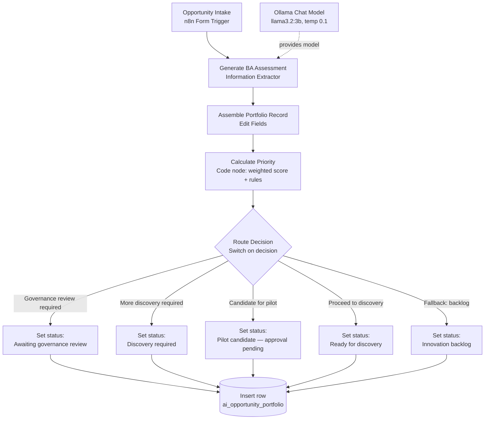
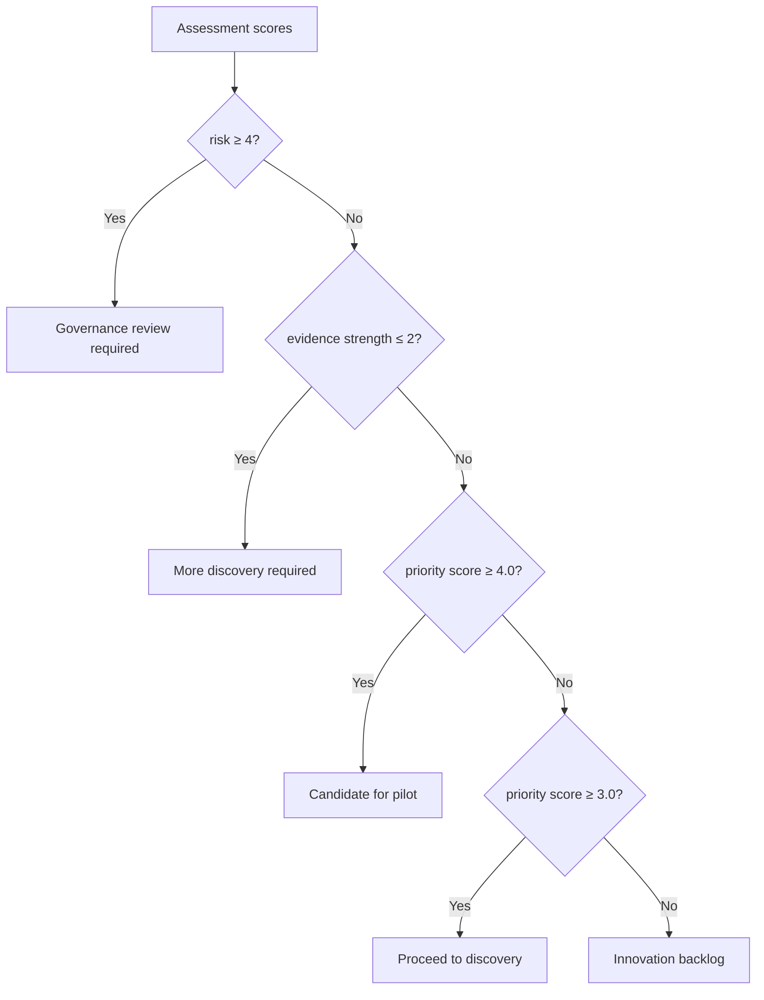

# Architecture diagram and screenshot guide

## Workflow architecture (Mermaid)



## Routing logic (Mermaid)



## Screenshots

Two screenshots are included (`workflow-canvas.png` and `intake-form.png`). Two remain. Screenshots are never fabricated. To complete the visuals, capture the remaining images below and save them in this `assets/` folder, then update the placeholders in the [README](../README.md#19-screenshots).

| # | Screenshot | Save as | What to capture |
|---|------------|---------|-----------------|
| 1 | Workflow canvas | `assets/workflow-canvas.png` | The whole workflow open in the n8n editor, showing all nodes and the five branches |
| 2 | Opportunity intake form | `assets/intake-form.png` | The rendered intake form a colleague fills in |
| 3 | Data Table results | `assets/portfolio-results.png` | Rows in `ai_opportunity_portfolio`, showing `decision`, `priority_score` and `status` |
| 4 | Governance routing | `assets/governance-routing.png` | A high-risk submission (for example TC-02) landing at "Awaiting governance review" |

### Before you capture

Please check that none of the following are visible in any screenshot:

- API keys, tokens, passwords or credential values
- Email addresses or account names
- Your local username or machine name in a path or title bar
- n8n credential details
- Any unrelated browser tabs, bookmarks or notifications
- Any real company, customer or learner information

Crop or blur anything sensitive before saving. Once saved, replace the placeholder lines in the README's Screenshots section with standard image links, for example:

```markdown

```
